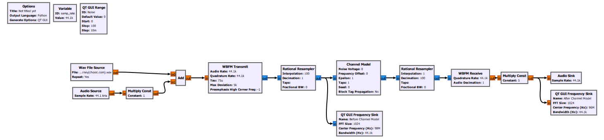
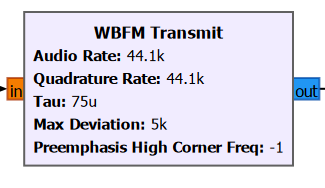
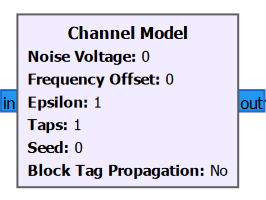
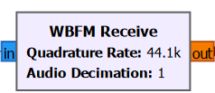

# FM Transmitter & Receiver with Channel Model (GNU Radio)

## Overview
This project demonstrates a **complete FM communication system** built in GNU Radio.  
It includes:

- **FM Transmitter (TX)** – Modulates audio into an FM waveform  
- **Channel Model** – Adds realistic impairments like noise, frequency offset, multipath  
- **FM Receiver (RX)** – Demodulates the FM signal back to audio  
- **Spectrum Visualization** – Plots before and after the channel  

This design is ideal for **education, experimentation, and extension to SDR hardware** (RTL-SDR, HackRF, USRP, etc.).

---

## Flowgraph

The system has three main sections:
1. **Transmitter Chain**
2. **Channel Model**
3. **Receiver Chain**

---

## Block-by-Block Explanation

### 🔹 1. Sources

#### **WAV File Source**
- Reads a `.wav` file (e.g., music or speech).
- Configured to repeat continuously.
- Used to provide a fixed, known audio input.

#### **Audio Source**
- Captures live audio from the microphone.
- Default sample rate = **44.1 kHz** (standard CD-quality audio).

#### **Add Block**
- Mixes the two inputs (WAV + live audio).
- This lets you transmit either or both signals.

#### **Multiply Const (Gain Control)**
- Constant = `1` (acts as input gain).
- Adjust this if your audio input is too weak or too strong.

---

### 🔹 2. FM Transmitter

#### **WBFM Transmit**
- Converts the audio signal into **wideband FM** (WBFM).  
- **Key Parameters:**
  - **Audio Rate (44.1 kHz):** The input audio sampling rate.  
  - **Quadrature Rate (441 kHz):** The output complex sample rate after FM modulation.  
    - This must be higher than audio rate to represent frequency deviations accurately.  
    - “Quadrature” means the signal is represented with I/Q (In-phase & Quadrature) components.  
  - **Max Deviation (5 kHz):** Maximum shift from carrier frequency due to audio.  
  - **Tau (75 µs):** Used for **pre-emphasis filtering**.
    - Pre-emphasis boosts high-frequency components before transmission.  
    - Purpose: Improves Signal-to-Noise Ratio (SNR) for higher frequencies.  
    - The receiver will later apply a **de-emphasis filter** to restore balance.

#### **Why Pre-emphasis?**
High frequencies in audio are more prone to noise. Pre-emphasis artificially boosts them, and the receiver’s de-emphasis reduces them back, along with any added noise.  
This is a **classic FM broadcast technique**.

---

### 🔹 3. Resampling & Channel

#### **Rational Resampler (Interp=100, Decim=1)**
- Upsamples the signal (×100) for channel modeling.
- Why? A higher sample rate allows us to simulate fine channel impairments like multipath delays.

#### **Channel Model**

- Simulates real-world impairments:
  - **Noise Voltage:** Adds Gaussian noise.  
  - **Frequency Offset:** Simulates transmitter/receiver LO mismatch.  
  - **Epsilon:** Models clock/timing errors.  
  - **Taps:** Adds multipath (reflections).  
- Useful for testing receiver robustness.

#### **QT GUI Frequency Sink (Before Channel)**
- Displays the spectrum of the FM-modulated signal before impairments.

---

### 🔹 4. Receiver Chain

#### **Rational Resampler (Interp=1, Decim=100)**
- Downsamples the channel output back to match RX processing rate.

#### **WBFM Receive**

- Demodulates the FM signal back to baseband audio.
- **Key Parameters:**
  - **Quadrature Rate (44.1 kHz):** Must match TX’s audio rate.  
  - **Audio Decimation:** Set to 1 for direct playback.  
  - **De-emphasis Filter:** Built-in, cancels the TX pre-emphasis effect.

#### **Multiply Const (Output Gain)**
- Constant = `5` (boosts the recovered audio volume).

#### **Audio Sink**
- Plays the demodulated audio through your system’s speakers.

#### **QT GUI Frequency Sink (After Channel)**
- Displays the spectrum of the received signal after channel impairments.

---

## Observations

1. **Noise Voltage = 0** → clear audio.  
2. **Increasing Noise Voltage** → static/distorted audio.  
3. **Frequency Offset** → shifted carrier, distortion unless corrected.  
4. **Multipath (Taps)** → echo-like fading effects.  

---

## Applications
- Teaching tool for **digital communications & modulation**.  
- Testing FM receiver resilience against noise/fading.  
- Simulation of real-world wireless channels.  
- Extendable to **SDR hardware** for real transmissions.

---

## 📚 References
- [GNU Radio Documentation](https://wiki.gnuradio.org)  
- Proakis, *Digital Communications*  
- Haykin, *Communication Systems*  

---
